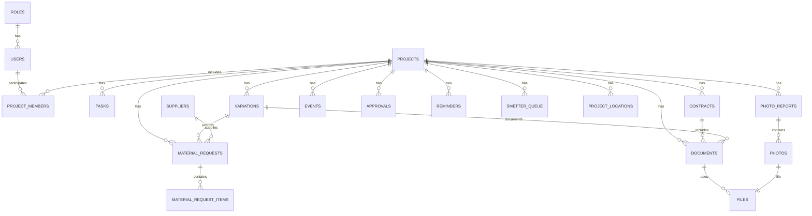

# Детальная схема базы данных MVP

## 1. Принципы модели

База строится вокруг объекта строительства.

Главные связи:

- объект связывает задачи, документы, заявки, фото, договоры, допработы, события и сроки;
- любая важная сущность должна иметь автора, ответственного, статус и дату создания;
- файлы хранятся отдельно, а в базе лежат ссылки и метаданные;
- удаление лучше заменять архивированием;
- интеграции с Bitrix и Сметтером должны хранить внешние ID.

## 2. Основные таблицы

### users

Пользователи системы.

Поля:

- id uuid primary key
- full_name text not null
- role_id uuid references roles(id)
- phone text
- email text unique
- is_active boolean default true
- created_at timestamptz
- updated_at timestamptz

### roles

Роли пользователей.

Поля:

- id uuid primary key
- code text unique not null
- title text not null
- description text

Базовые роли:

- owner
- construction_manager
- sales_manager
- procurement_manager
- estimator
- foreman
- viewer

### projects

Объекты строительства.

Поля:

- id uuid primary key
- title text not null
- customer_name text
- customer_contacts jsonb
- status text not null
- address text
- navigator_url text
- bitrix_deal_id text
- bitrix_url text
- smetter_project_id text
- smetter_url text
- construction_manager_id uuid references users(id)
- foreman_id uuid references users(id)
- estimator_id uuid references users(id)
- procurement_manager_id uuid references users(id)
- planned_start_date date
- planned_end_date date
- actual_start_date date
- actual_end_date date
- main_estimate_amount numeric(14,2) default 0
- approved_variations_amount numeric(14,2) default 0
- unresolved_overbudget_amount numeric(14,2) default 0
- notes text
- archived_at timestamptz
- created_by uuid references users(id)
- created_at timestamptz
- updated_at timestamptz

Статусы:

- transferred_to_construction
- preparation
- in_progress
- paused
- acceptance
- document_closing
- completed
- archived

### project_members

Связь пользователей с объектами.

Поля:

- id uuid primary key
- project_id uuid references projects(id)
- user_id uuid references users(id)
- role_on_project text
- can_view boolean default true
- can_edit boolean default false
- created_at timestamptz

Уникальность:

- unique(project_id, user_id)

## 3. Задачи

### tasks

Поля:

- id uuid primary key
- project_id uuid references projects(id)
- title text not null
- description text
- creator_id uuid references users(id)
- assignee_id uuid references users(id)
- due_date date
- priority text default 'normal'
- status text not null
- related_type text
- related_id uuid
- completed_at timestamptz
- archived_at timestamptz
- created_at timestamptz
- updated_at timestamptz

Статусы:

- new
- in_progress
- waiting_answer
- review
- completed
- cancelled
- overdue

Приоритеты:

- low
- normal
- high
- urgent

## 4. Материалы и снабжение

### material_requests

Поля:

- id uuid primary key
- project_id uuid references projects(id)
- creator_id uuid references users(id)
- contract_id uuid references contracts(id)
- variation_id uuid references variations(id)
- estimate_section text
- basis_type text not null
- needed_at date
- status text not null
- procurement_status text not null
- smetter_status text not null
- supplier_id uuid references suppliers(id)
- invoice_document_id uuid references documents(id)
- total_amount numeric(14,2)
- comment text
- decision_required boolean default false
- decision_id uuid references approvals(id)
- created_at timestamptz
- updated_at timestamptz

Основания:

- main_estimate
- main_estimate_overspend
- material_replacement
- additional_work
- additional_agreement
- over_budget_cost
- warranty_work
- internal_error_or_loss

Статусы закупки:

- new
- clarification
- approval
- ordered
- delivery
- delivered
- closed
- problem
- cancelled

Статусы Сметтера:

- not_required
- waiting_to_enter
- entered
- included_in_act
- error
- needs_review

Правило:

Если basis_type != main_estimate, то decision_required = true или variation_id должен быть заполнен.

### material_request_items

Поля:

- id uuid primary key
- material_request_id uuid references material_requests(id)
- name text not null
- quantity numeric(14,3)
- unit text
- estimated_quantity numeric(14,3)
- estimated_price numeric(14,2)
- actual_price numeric(14,2)
- comment text

## 5. Допработы и отклонения

### variations

Поля:

- id uuid primary key
- project_id uuid references projects(id)
- type text not null
- title text not null
- description text
- initiator_id uuid references users(id)
- reason text
- estimate_section text
- estimated_amount numeric(14,2)
- final_amount numeric(14,2)
- approval_due_date date
- execution_due_date date
- responsible_user_id uuid references users(id)
- status text not null
- financial_decision text not null default 'not_decided'
- contract_id uuid references contracts(id)
- document_id uuid references documents(id)
- act_document_id uuid references documents(id)
- smetter_id text
- smetter_url text
- created_at timestamptz
- updated_at timestamptz

Типы:

- additional_work
- material_overspend
- material_replacement
- hidden_work
- estimate_error
- customer_change
- company_cost
- disputed_position

Статусы:

- detected
- decision_required
- estimator_review
- estimate_ready
- approval
- approved
- rejected
- in_progress
- completed
- included_in_separate_act
- written_off_company_cost
- closed

Решения:

- customer
- company
- contractor
- disputed
- not_decided

## 6. Договоры

### contracts

Поля:

- id uuid primary key
- project_id uuid references projects(id)
- parent_contract_id uuid references contracts(id)
- type text not null
- counterparty text
- number text
- signed_at date
- starts_at date
- ends_at date
- amount numeric(14,2)
- responsible_user_id uuid references users(id)
- status text not null
- file_id uuid references files(id)
- smetter_id text
- smetter_url text
- created_at timestamptz
- updated_at timestamptz

Типы:

- customer_contract
- additional_agreement
- supplier_contract
- contractor_contract
- equipment_rent
- other

Статусы:

- draft
- active
- expiring_soon
- expired
- extended
- closed
- archived

Индексы:

- index(project_id)
- index(ends_at)
- index(status)
- index(responsible_user_id)

## 7. Документы и файлы

### documents

Поля:

- id uuid primary key
- project_id uuid references projects(id)
- contract_id uuid references contracts(id)
- variation_id uuid references variations(id)
- material_request_id uuid references material_requests(id)
- type text not null
- title text not null
- version text
- file_id uuid references files(id)
- author_id uuid references users(id)
- responsible_user_id uuid references users(id)
- document_date date
- due_date date
- status text not null
- related_type text
- related_id uuid
- smetter_id text
- smetter_url text
- archived_at timestamptz
- created_at timestamptz
- updated_at timestamptz

Типы:

- contract
- additional_agreement
- main_estimate
- variation_estimate
- project_design
- drawing
- detail_node
- act
- ks_2
- ks_3
- invoice
- waybill
- hidden_works_photo
- other

Статусы:

- draft
- review
- active
- signed
- outdated
- archived

### files

Поля:

- id uuid primary key
- storage_bucket text not null
- storage_path text not null
- original_name text
- mime_type text
- size_bytes bigint
- uploaded_by uuid references users(id)
- project_id uuid references projects(id)
- visibility text default 'internal'
- created_at timestamptz

Видимость:

- internal
- customer_allowed

## 8. Фотоотчеты

### photo_reports

Поля:

- id uuid primary key
- project_id uuid references projects(id)
- author_id uuid references users(id)
- report_date date
- work_stage text
- zone text
- comment text
- visible_to_customer boolean default false
- related_type text
- related_id uuid
- created_at timestamptz

### photos

Поля:

- id uuid primary key
- photo_report_id uuid references photo_reports(id)
- file_id uuid references files(id)
- caption text
- created_at timestamptz

## 9. Журнал событий

### events

Поля:

- id uuid primary key
- project_id uuid references projects(id)
- type text not null
- text text not null
- author_id uuid references users(id)
- related_type text
- related_id uuid
- visibility text default 'internal'
- created_at timestamptz

Типы:

- decision
- comment
- deadline_change
- document
- problem
- customer_approval

Видимость:

- internal
- customer_allowed

## 10. Согласования

### approvals

Поля:

- id uuid primary key
- project_id uuid references projects(id)
- type text not null
- title text not null
- amount numeric(14,2)
- owner_id uuid references users(id)
- next_step text
- due_date date
- status text not null
- related_type text
- related_id uuid
- decided_by uuid references users(id)
- decided_at timestamptz
- decision text
- created_at timestamptz
- updated_at timestamptz

Типы:

- variation
- overbudget
- contract
- document
- separate_act
- deadline_change
- disputed_position

Статусы:

- new
- in_review
- waiting_customer
- approved
- rejected
- postponed
- closed

## 11. Поставщики и локации

### suppliers

Поля:

- id uuid primary key
- name text not null
- category text
- address text
- navigator_url text
- contact_name text
- contact_phone text
- terms text
- notes text
- is_active boolean default true
- created_at timestamptz
- updated_at timestamptz

### project_locations

Дополнительные локационные данные объекта.

Поля:

- id uuid primary key
- project_id uuid references projects(id)
- title text
- address text
- navigator_url text
- access_notes text
- contact_on_site text
- created_at timestamptz
- updated_at timestamptz

## 12. Напоминания и сроки

### reminders

Поля:

- id uuid primary key
- related_type text not null
- related_id uuid not null
- project_id uuid references projects(id)
- responsible_user_id uuid references users(id)
- remind_at timestamptz not null
- type text not null
- status text not null
- sent_at timestamptz
- created_at timestamptz

Типы:

- contract_expiration
- task_due
- material_needed
- approval_due
- document_due
- variation_due

Статусы:

- pending
- sent
- dismissed
- cancelled

## 13. Очередь Сметтера

### smetter_queue

Поля:

- id uuid primary key
- project_id uuid references projects(id)
- related_type text not null
- related_id uuid not null
- type text not null
- title text not null
- owner_id uuid references users(id)
- status text not null
- external_id text
- error_message text
- processed_at timestamptz
- created_at timestamptz
- updated_at timestamptz

Типы:

- materials
- work_completion
- act
- ks_2
- ks_3
- estimate
- variation

Статусы:

- waiting_to_enter
- entered
- needs_review
- error
- no_basis_decision
- included_in_act

## 14. Комментарии

### comments

Универсальные комментарии к сущностям.

Поля:

- id uuid primary key
- project_id uuid references projects(id)
- related_type text not null
- related_id uuid not null
- author_id uuid references users(id)
- text text not null
- created_at timestamptz
- updated_at timestamptz
- archived_at timestamptz

## 15. Индексы

Рекомендуемые индексы:

- projects(status)
- projects(foreman_id)
- projects(construction_manager_id)
- tasks(project_id)
- tasks(assignee_id)
- tasks(due_date)
- tasks(status)
- material_requests(project_id)
- material_requests(basis_type)
- material_requests(procurement_status)
- material_requests(smetter_status)
- variations(project_id)
- variations(status)
- variations(financial_decision)
- contracts(project_id)
- contracts(ends_at)
- contracts(status)
- documents(project_id)
- documents(type)
- documents(due_date)
- events(project_id)
- events(created_at)
- approvals(project_id)
- approvals(due_date)
- approvals(status)
- reminders(remind_at)
- reminders(status)
- smetter_queue(status)

## 16. Row Level Security

Для Supabase нужно включить RLS на ключевых таблицах.

Базовая логика:

- owner видит все;
- construction_manager видит все строительные объекты;
- sales_manager может создавать объект и видеть связанные им объекты;
- procurement_manager видит заявки, поставщиков и связанные объекты;
- estimator видит объекты, сметы, документы, допработы и акты;
- foreman видит только объекты, где он участник или назначенный прораб;
- viewer только читает разрешенные объекты.

Практический вариант для MVP:

- таблица project_members определяет доступ к объекту;
- большинство сущностей проверяют доступ через project_id;
- глобальные роли owner и construction_manager имеют расширенный доступ.

## 17. Важные ограничения данных

1. material_requests.basis_type обязателен.
2. Если basis_type != main_estimate, нужен variation_id или approval_id.
3. contracts.ends_at нужен для договоров со сроком действия.
4. documents.project_id обязателен.
5. events.project_id обязателен.
6. files не удаляются физически сразу, сначала архивируются или отвязываются.
7. projects нельзя архивировать при открытых критичных задачах, заявках и согласованиях.

## 18. ER-схема

