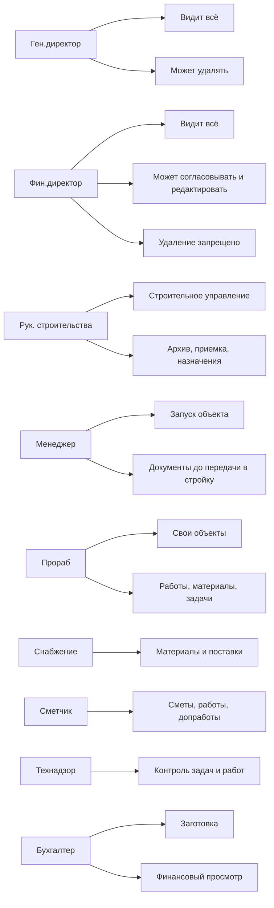

# Инфографика ролей и доступов

Дата: 2026-05-21

Этот файл фиксирует текущую модель доступа в "Строительном контуре". Он нужен как рабочая карта: кто что видит, кто что может менять, где доступ только на просмотр, а где действие запрещено.

## Легенда

| Обозначение | Значение |
| --- | --- |
| Полный | Раздел виден, доступны рабочие действия по роли |
| Просмотр | Раздел виден, но без ключевых управляющих действий |
| Ограничено | Видна только часть данных, обычно по своим объектам или типам документов |
| Нет | Раздел скрыт или сервер отдаёт пустой список |
| Удаление запрещено | Роль может работать с данными, но не может удалять сущности |

## Слои доступа

## Матрица Разделов

| Роль | Рабочий стол | Объекты | Задачи | Работы | Материалы | Допработы | Локации | База знаний | Обратная связь | Журнал |
| --- | --- | --- | --- | --- | --- | --- | --- | --- | --- | --- |
| Ген.директор | Полный | Полный | Полный | Полный | Полный | Полный | Полный | Полный | Полный | Полный |
| Фин.директор | Полный | Полный, без удаления | Полный, без удаления | Полный | Полный | Полный | Полный | Полный, без удаления | Полный, без удаления | Полный |
| Рук. строительства | Полный | Полный | Полный | Полный | Полный | Полный | Полный | Полный | Полный | Полный |
| Менеджер | Просмотр | Создание и редактирование до передачи | Нет | Нет | Нет | Нет | Просмотр | Просмотр | Полный | Нет |
| Прораб | Ограничено | Свои объекты | Свои задачи | Свои объекты | Свои заявки и объекты | Нет | Просмотр | Просмотр | Нет | Нет |
| Снабжение | Ограничено | Просмотр | Нет | Нет | Полный по заявкам | Нет | Просмотр | Просмотр | Нет | Нет |
| Сметчик | Ограничено | Просмотр | Свои задачи | Просмотр работ | Просмотр материалов | Просмотр и участие | Нет | Просмотр | Нет | Нет |
| Технадзор | Ограничено | Просмотр | Полный контроль задач | Просмотр работ | Просмотр материалов | Нет | Просмотр | Просмотр | Нет | Нет |
| Бухгалтер | Просмотр | Просмотр | Нет | Нет | Просмотр | Просмотр | Просмотр | Финансовые документы | Нет | Просмотр |

## Финансы И Документы

| Роль | Видит суммы смет | Видит договоры и акты | Видит проектную документацию | Видит внешние ссылки Сметтера | Комментарий |
| --- | --- | --- | --- | --- | --- |
| Ген.директор | Да | Да | Да | Да | Полный контроль |
| Фин.директор | Да | Да | Да | Да | Всё, кроме удаления |
| Рук. строительства | Да | Да | Да | Да | Полный строительный контур |
| Менеджер | Да | Да | Да | Да | Нужен для запуска объекта |
| Прораб | Нет | Нет | Да | Нет | Только рабочие материалы объекта |
| Снабжение | Нет | Нет | Да | Нет | Материалы, заявки, локации |
| Сметчик | Да | Да | Да | Да | Сметы, работы, допработы |
| Технадзор | Нет | Нет | Да | Нет | Контроль выполнения |
| Бухгалтер | Да | Да | Ограниченно | Да | Заготовка под будущий учет |

## Управляющие Действия

| Действие | Ген.директор | Фин.директор | Рук. строительства | Менеджер | Прораб | Снабжение | Сметчик | Технадзор | Бухгалтер |
| --- | --- | --- | --- | --- | --- | --- | --- | --- | --- |
| Создать объект | Да | Да | Да | Да | Нет | Нет | Нет | Нет | Нет |
| Сохранить черновик объекта | Да | Да | Да | Да | Нет | Нет | Нет | Нет | Нет |
| Передать объект в работу | Да | Да | Нет | Да | Нет | Нет | Нет | Нет | Нет |
| Принять объект в работу | Да | Да | Да | Нет | Нет | Нет | Нет | Нет | Нет |
| Назначить ответственных | Да | Да | Да | Нет | Нет | Нет | Нет | Нет | Нет |
| Вернуть объект на доработку | Да | Да | Да | Нет | Нет | Нет | Нет | Нет | Нет |
| Отправить объект в архив | Да | Да | Да | Нет | Нет | Нет | Нет | Нет | Нет |
| Вернуть объект из архива | Да | Да | Да | Нет | Нет | Нет | Нет | Нет | Нет |
| Удалить объект навсегда | Да | Нет | Нет | Нет | Нет | Нет | Нет | Нет | Нет |
| Удалить задачу | Да | Нет | Да | Нет | Нет | Нет | Нет | Нет | Нет |
| Удалить материал базы знаний | Да | Нет | Да | Нет | Нет | Нет | Нет | Нет | Нет |
| Удалить сообщение обратной связи | Да | Нет | Да | Да | Нет | Нет | Нет | Нет | Нет |
| Согласовать допработу | Да | Да | Да | Нет | Нет | Нет | Нет | Нет | Нет |
| Выгрузить выполненные заявки | Да | Да | Да | Нет | Нет | Да | Нет | Нет | Да |

## Текущие Решения

1. Фин.директор добавлен как роль с полным обзором системы и правом участвовать в согласованиях, но без удаления.
2. Бухгалтер добавлен как заготовка: видит финансово-документальный контур, но пока почти ничего не меняет.
3. Ген.директор остаётся единственной ролью, которая может удалить объект навсегда.
4. Удаление задач оставлено только ген.директору и руководителю строительства.
5. Прорабы по-прежнему видят только закреплённые за ними объекты и связанные с ними задачи/работы/материалы.

## Что Ещё Нужно Уточнить Позже

1. Должен ли бухгалтер видеть поставщиков, счета и платежи, когда появится финансовый блок.
2. Должен ли фин.директор получать все уведомления или только финансовые и управленческие.
3. Нужна ли отдельная роль "Юрист" для договоров, допников и актов.
4. Должен ли менеджер видеть обратную связь из MAX постоянно или только сообщения, связанные с запуском объектов.
